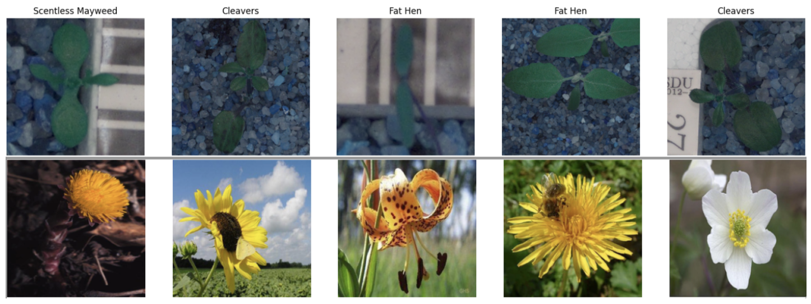

# Image classifier

## Image classifier to detect plant and flower species

 University is doing research to understand the characteristics of plant and plant seedlings at various stages of growth and also the characteristics of flowers. Their dataset comprises of 4750 images from <b>12 plant species</b> and 1360 images from <b>17 flower categories</b> (OxFlower dataset). The objective is to create a classifier that can determine plant's and flower's species from an image. The task was accomplished by developing multiple models (CNN, transfer learning, hyper-parameter tuning, image augmentation) and then selecting the best model capable of classifying the plant's species and flower species. 
 

    

## ML libraries/Architectures
TensorFlow, Scikit-learn, Neural Network, Convolutional Neural Network, Transfer learning (VGG16), ImageDataGenerator